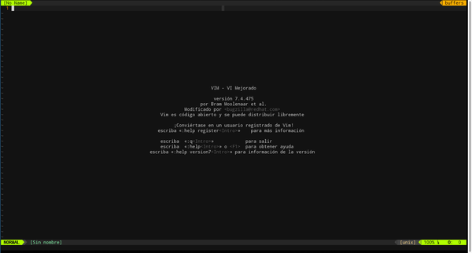

# Vimcfg
Configuración personal de Vim.

## Instalación
Clonar el repositorio en la home y ejecutar el script de instalación. Este script actualiza el **.vimrc** cargando la configuración de **.vimcfg**. Si previamente ya tenemos un **.vimrc**, el script hace un backup de él.
```shell
cd ~
git clone https://github.com/francescarpi/vimcfg.git .vimcfg
cd .vimcfg
./install.sh
```

## Plugins instalados
* ctrlp: Permite localizar ficheros en el entorno de trabajo y abrirlos en la misma pestaña, o nuevas. (Con la extensión 'funky')
* flattr.vim: Esquema de colores.
* gundo.vim: Permite visualizar un histórico de cambios
* indentLine: Muestra lineas verticales al principio de las identaciones. Ayuda muy visual.
* nerdtree: Navegador de archivos en formato árbol
* python-syntax: Reconocimiento de sintaxi para python.
* tcomment: Nos facilita comentar y descomentar código.
* ultisnips: Gestión y uso de snippets.
* vim-airline: Barra de estado colorida. Recomendable instalar *Power line fonts* (https://github.com/Lokaltog/powerline-fonts)
* vim-javascript-syntax: Reconocimiento de sintaxi para javascript
* vim-less: Reconocimiento sintaxi para less.
* vim-markdown: Reconocimiento de sintaxi para markdown.
* vim-multiple-cursors: Nos permite editar con múltiples cursores.

## Movimientos de cursor

| Comando  | Descripción |
| ------------- | ------------- |
| H | Situar cursor al principio de la página  |
| M | Situar cursor en medio de la página |
| L | Situar cursor al final de la página |
| zz | Centrar página verticalmente, dejando en el centro la linea donde tenemos el cursor |
| Ctrl+d | Avanzar página |
| Ctrl+u | Retroceder página |
| :(num) | Ir a un número de linea |
| :(num)% | Vamos al tanto por ciento del documento. Ejemplo :90% vamos casi al final |
| 0 | Cero. Se situa al inicio de la linea |
| $ | Se situa al final de la l inea |
| w | Saltar palabras hacia adelante. El cursor se queda al principio de la palabra |
| e | Saltar palabras hacia adelante. El cursor se queda al final de la palabra |
| b | Saltar palabras hacia atrás |
| gg | Saltar a la primera linea del documento |
| G | Saltar a la última linea del documento |
| % | Saltar al cierre de un bracket

## Edición de texto
| Comando  | Descripción |
| ------------- | ------------- |
| A | Insertar texto al final de la linea |
| I | Insertar texto al principio de la linea |
| o | Insertar debajo del cursor |
| O | Insertar encima del cursor |
| u | Deshacer cambios |
| Ctrl+r | Rehacer cambios |
| :GundoShow | Muestra árbol de histórico de cambios |
| x | Borrar un carácter |
| D | Borrar hasta el final de la linea |
| dw | Borrar una palabra |
| dd | Borrar una linea |
| Ctrl-n | Autocompletar |
| = | Corrige tabulación de la area marcada |

## Modo visual
| Comando  | Descripción |
| ------------- | ------------- |
| v | Se activa selección a nivel de carácter |
| V | Se activa selección a nivel de linea |
| Ctrl+v | Seleccón a nivel de un cuadro |
| Ctrl+n | Cursor múltiple. Encuentra la siguiente palabra que coincida con la que está debajo de cursor y las va marcando para edición múltiple |

## Buscar/Marcar
| Comando  | Descripción |
| ------------- | ------------- |
| * | Busca todas las palabras que coincidan con la que está debajo del cursor |
| n | Salta al siguiente resultado de la búsqueda |
| :noh | Desmarca toda las palabras resltadas después de realizar una búsqueda |
| /(string) | Buscar una cadena |
| :vimgrep /patron/gj ****/\*.ext | Buscar un patrón, de forma recursiva, en todos los archivos indicados |
| :copen | Abre ventana para navegar entre los resultados del vimgrep. Se cierra con un cclose |

## Pestañas
| Comando  | Descripción |
| ------------- | ------------- |
| :tabe (archivo) | Abrir una nueva pestaña. El archivo es opcional |
| gt | Siguiente pestaña |
| gT | Pestaña anterior |
| (num)gt | Ir a la pestaña num |
| gl | Saltar al último tab utilizado. Este comando es propio. No viene por defecto |
| tabs | Mostrar lista de tabs |
| tabm (num) | Mover un tab a la posición indicada. Si no se indica posición, se envía al final |

## Splits
| Comando  | Descripción |
| ------------- | ------------- |
| :vs | Crear split vertical |
| :split | Crear split horizontal |
| Ctrl+w (movimiento cursor) | Navegar entre los splits |

## Otros
| Comando  | Descripción |
| ------------- | ------------- |
| :so% | Recargar el fichero de configuración de vim |
| set filetype=(tipo) | Modificamos el tipo de fichero que se está editando. |

## Comentar
Funcionalidades del plugin tcomment.

| Comando  | Descripción |
| ------------- | ------------- |
| gc | Comentar el bloque visual |
| gcc | Comentar una linea |
| gcgc | Descomentar el bloque donde esté situado el cursor |

## Folding
Abrir/cerrar bloques de código del documento

| Comando  | Descripción |
| ------------- | ------------- |
| zc | Cerrar bloque actual |
| zo | Abrir bloque actual |
| zi | Abrir o cerrar todos los bloques del documento |

## Navegación de ficheros
| Comando  | Descripción |
| ------------- | ------------- |
| Ctrl+p | Abre ctrlp. Ctrl+f y Ctrl+b moverse entre distintos tipos de búsqued. Ficheros, buffers... |
| Ctrl+f | Cuando está abierto CtrlP cambia a modo fichero |
| Ctrl+b | Cuando está abierto CtrlP cambia a modo buffers |
| :NERDTree | Abre este plugin para navegar entre archivos |
| :ls | Listado de buffers |
| :bd | Cierra un buffer. Opcionalmente se le puede indicar un número |
| :b (num) | Va a un buffer concreto |
| :bn | Siguiente buffer |
| :bp | Buffer anterior |

Modos de Ctrlp:
* files: Muestra ficheros de la carpeta de trabajo
* funky: Muestra métodos y clases del fichero actual.
* buffers: Muestra listado de buffers
* mru files: Ficheros abiertos recientemente

## Copiar/pegar
| Comando  | Descripción |
| ------------- | ------------- |
| y | Copiar selección |
| Y | Copia la linea actual, donde estamos |
| p | Pegar |
| c | Cortar |
| F2 | Cambiar entre modo paste y modo no-paste, para pegar desde el portapapeles del sistema sin que nos haga la identación automática |

## Capturas de pantalla



